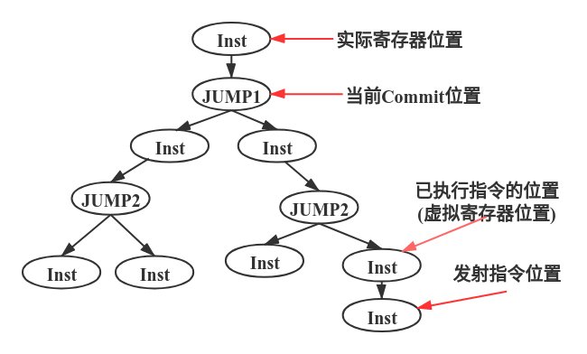

# Tomasolu模拟器报告

**计71 钟闰鑫 2017010306**

## 模拟器设计

使用方法见```README.md```

模拟器主要分为```Reservation Station```，```Funciontal Units```，```Reorder Buffer```与```Branch Target Buffer```等

* ```Reservation Station```

    保留站包括算术运算的保留站与```Load Buffer```，提供了检查保留站是否有空闲，将一个指令放入保留站中(返回对应的保留站指针)，选出一个就绪的保留站等接口

* ```Functional Units```

    功能单元提供了将一个就绪的保留站放入，以及写回的接口

    在保留站与功能单元传递信息的结构是保留站指针，这个指针维护了一个```std::vector<ReservationStations*>```结构，里面放入这个正在等待该保留站结果的保留站，在写回时，通过遍历这个结构来更新对应的保留站操作数情况

* ```Reorder Buffer```与```Branch Target Buffer```

    ```Reorder Buffer```内部维护了一个```std::list```，当一条指令发射时会同时加入到这个```list```中，并返回对应的迭代器用于里面数据的更新(比如最终结果等)

    ```Reorder Buffer```还维护了一套```virtual register```用于分支预测，这个在扩展设计会更详细介绍

    ```Branch Target Buffer```采用了2bit的```Branch History Table```，并维护了每次分支时的地址，能在预测时能同时给出预测的地址

* 其他

    ```Parser```对```nel```文件进行解析，```CycleCounter```与```Record```都为全局单例，前者记录当前周期，后者记录诸如指令状态(发射，执行完毕，写回周期)以及分支预测结果等

整个模拟的流程大致如下

* 无分支预测

    1. 功能部件写回，更新所有依赖的保留站与寄存器，其中若```Jump```写回，则流水线重启

    2. 如果当前指令合法(```inst_idx < size```)且流水线未被暂停，则尝试发射新指令，如果保留站有空闲，则成功发射，否则发射失败

        其中若成功发射的指令是```Jump```，则流水线暂停

    3. 不断地查找就绪的保留站，尝试放入功能部件进行执行

    4. 功能部件进行更新(剩余执行周期减少)

* 分支预测

    1. 功能部件写回，更新所有依赖的保留站，写入虚拟寄存器

    2. 进行指令提交(```commit```)，若提交```Jump```指令并预测成功则继续，否则清空当前所有虚拟寄存器，用实际寄存器来重置虚拟寄存器，重置当前指令位置

        清除```predicting```与```stall```标志

    3. 如果当前指令合法且流水线未被暂停(```stall```)，则尝试发射新指令，如果保留站有空闲则成功发射，并更新到```Reorder Buffer```中，若发射指令是```Jump```，则进行分支预测，设置下一个指令位置

        若在上次```Jump```指令未被```commit```时尝试发送另一条```Jump```指令，则发射失败，流水线开始暂停

    4. 不断地查找就绪的保留站，尝试放入功能部件进行执行

    5. 功能部件进行更新

## 结果报告

测试平台为自己的笔记本，有一定的性能波动；分支预测已通过验证寄存器值确认了其正确性

### 性能报告

| 测例         | 类型        | 行数    | 流水线运行时间(ms) | 分支预测流水线运行时间(ms) |
| ------------ | ----------- | ------- | ------------------ | -------------------------- |
| 0.basic.nel  | Basic       | 6       | 0.005127           | 0.011963                   |
| 1.basic.nel  | Basic       | 34      | 0.010986           | 0.029053                   |
| 2.basic.nel  | Basic       | 27      | 0.008057           | 0.026855                   |
| 3.basic.nel  | Basic       | 28      | 0.010010           | 0.031006                   |
| 4.basic.nel  | Basic       | 24      | 0.009033           | 0.029053                   |
| Fact.nel     | Extend      | 10      | 0.013916           | 0.049072                   |
| Fabo.nel     | Extend      | 14      | 0.008057           | 0.035156                   |
| Example.nel  | Extend      | 8       | 0.006836           | 0.028076                   |
| Gcd.nel      | Extend      | 21      | 2212.743164        | 3152.599854                |
| Mul.nel      | Performance | 1018    | 0.153076           | 1.015137                   |
| Big_test.nel | Performance | 1000000 | 61.813965          | 98.442139                  |

### 分支预测报告

占比是以非流水线运行周期作为Baseline来得到，越低越好

| 测例        | 非流水线运行周期 | 流水线运行周期(占比) | 分支预测流水线运行周期(占比) | 分支预测准确率 |
| ----------- | ---------------- | -------------------- | ---------------------------- | -------------- |
| Fact.nel    | 526              | 278(52.85%)          | 166(31.55%)                  | 95%            |
| Fabo.nel    | 98               | 48(48.97%)           | 49(50%)                      | 40%            |
| Example.nel | 38               | 25(65.78%)           | 26(68.42%)                   | 33.33%         |
| Gcd.nel     | 83155818         | 63465742(76.32%)     | 55568726(66.82%)             | 92.72%         |

## 扩展设计

### Jump

类似类似实际流水线的实现，这里扩展了原来32个寄存器到33个，扩展的寄存器作为```PC```使用，由此就统一了```Jump```与其他指令，这样```Jump```指令实际上也有一个目的寄存器就是```PC```，需要更新的时候就直接写入新的地址到```PC```里即可

### 分支预测

分支预测有着很多的细节，其大致的思想是在遇到```Jump```指令时，预测下一次指令的地址，当预测失败则进行现场的恢复，否则就继续

按照课上所学，对于Tomasolu的分支预测扩展一般是在指令生命周期中增加```commit```阶段，由此达到顺序发射，乱序执行，顺序确认(```commit```)的结果，```commit```阶段则将指令结果写入真实的寄存器，同时这样也能在此阶段设计异常，从而能够实现精确异常处理

但实际上这样的一个大致框架仍然有一些问题未被解决，例如

1. 无分支预测的流水线在写回阶段会更新所有依赖的保留站，并写入寄存器，但引入分支预测后，写入寄存器被延迟到了```commit```阶段，由于```commit```阶段是顺序的，很有可能```Reorder Buffer```里的一条指令已经```ready```，但由于其未位于```Reorder Buffer```头部而无法实际写入寄存器，考虑```RAW```问题，若有新指令需要该寄存器的值，应如何去取
2. 连续```Jump```如何处理，如何正确处理连续预测

由此模拟器采用了```virtual register```的设计来解决这些问题

大致来说，虚拟寄存器替代了实际寄存器的保存最新值的功能，所有保留站获得值将不再从实际寄存器而是从虚拟寄存器，而实际寄存器则作为了虚拟寄存器的一个备份，类似于数据库领域的备份，备份必须是绝对正确的，当前数据出问题时将会用备份来进行恢复，回到分支预测，即是当分支预测失败时(此时虚拟寄存器内容错误)，需要用实际寄存器来重置虚拟寄存器

由此所有的操作就顺利成章了，如下问题也能依次解决

* 何时更新虚拟寄存器

    在功能部件写回阶段，原tomasolu会写回到实际寄存器中，而现在则是将指令在```Reorder Buffer```设置为ready，而将值写入虚拟寄存器中，这确保了虚拟寄存器一直是(分支预测成功情况下的)最新值

* 何时更新实际寄存器

    在```commit```阶段，指令确认后，说明这次的写过结果必定是正确的，因此在这个阶段将指令的结果写回实际寄存器

    注意，这里我在最开始的设计是当指令确认后，将指令目的寄存器对应的虚拟寄存器的值写入实际寄存器，但这是错误的，考虑如下的指令序列

    ```c
    LOAD R0 1
    JUMP somewhere
    DIV R0 R3 R4
    ```

    如果采用最初的设计，将指令目的寄存器对应的虚拟寄存器的值写入实际寄存器，(忽略具体需要多少周期)假如Load指令与Div指令同时执行完毕，此时虚拟寄存器VR0会在写回阶段先被写入Load结果，然后写入Div结果覆盖那么现在开始commit Load指令，那么VR0结果会被写入R0，但如果之后的Jump分支预测失败，R0会被用来重置VR0，理论上R0最新值应该是Load的结果，在现在却是"不该执行的Div"的结果，这就导致了错误

    而若将指令结果写回实际寄存器，则将不存在这个问题

* 现在的```Register Result Status```还是原来的用法吗

    是的，原tomasolu算法在发射指令到保留站时，会检查源操作数对应寄存器的```Register Result Status```，如果指向一个保留站，说明这个操作数需要等待该保留站的结果，否则则可直接取寄存器值，该操作数ready

    而现在分支预测tomasolu算法在发射指令到保留站时，仍然会检查源操作数对应寄存器的```Register Result Status```，如果指向一个保留站就等待，但如果没有，则应当从虚拟寄存器中取值(因为现在的设计下虚拟寄存器的值才是最新的)

* 连续分支预测会出现问题吗，是否需要在连续预测时进行流水线暂停

    不会也不需要，连续分支预测的情况如下图树状结构所示

    

    当前设计确保了实际寄存器位置一定在commit位置之前，所以，如上图，目前所有分支预测都预测往右下走，现在已经连续经过两次分支预测了，但如果JUMP1这个分支的实际结果是向左走，那么虚拟寄存器位置会被重置为实际寄存器的位置(即内容被重置)，发射指令位置会被设置为JUMP1左下的指令，由此可知连续分支预测下也是不会出错的 

### 性能

性能方面主要就是关于写回时的设计

在功能部件中会存若干个```ReservationStation*```指针，每个(非空)代表一个正在执行的指令，而这个结构维护了一个```std:vector<ReservationStation*>```来代表所有等待该保留站结果的保留站，在写回阶段时只需要通过遍历这个结构就能更新完所有需要被更新的保留站，避免了暴力穷举

## 自设计测例

设计测例如下表

| 测例              | 行数 | 描述                                                    |
| ----------------- | ---- | ------------------------------------------------------- |
| nest_loop_{N}.nel | 17   | 三层循环，每层循环次数为N，用于比较分支预测与非分支预测 |

代码是很简单的三层循环，循环内部只是简单使用了一些算数指令，没有额外含义

注意，在```TestCase/```中只放入了```nest_loop.nel```测例，所有这些```nest_loop_{N}```测例只需要改动第一行代码的初值设置即可得到

结果如下

| N    | 非流水线周期 | 无分支预测流水线周期(占比) | 分支预测流水线周期(占比) | 分支预测准确率 |
| ---- | ------------ | -------------------------- | ------------------------ | -------------- |
| 1    | 61           | 36(59.01%)                 | 36(59.01%)               | 33.33%         |
| 2    | 100          | 61(61%)                    | 60(60%)                  | 58.82%         |
| 4    | 178          | 113(63.48%)                | 97(54.49%)               | 78.78%         |
| 8    | 334          | 221(66.16%)                | 173(51.79%)              | 89.23%         |
| 16   | 646          | 437(67.64%)                | 325(50.30%)              | 94.57%         |
| 32   | 1270         | 869(68.42%)                | 629(49.52%)              | 97.27%         |
| 64   | 2518         | 1733(68.82%)               | 1237(49.12%)             | 98.63%         |
| 128  | 5014         | 3461(69.02%)               | 2453(48.92%)             | 99.31%         |

* 可以看到，随着循环次数越来越多，分支预测流水线占比越来越少，而无分支预测流水线周期占比越来越多，这体现了分支预测在循环比较多的程序中的一个优势

## 与记分牌算法对比

Tomasolu算法与记分牌十分相似，其区别主要在于Tomasolu算法通过寄存器重命名(把Reservation Station看成寄存器)来解决了WAW和WRA冲突，而记分牌算法面对这两种冲突只能等待

在Tomasolu算法中，```Reservation Station```类似于寄存器，是可以存值的，而在记分牌算法中只有```Functional Status Units```，里面无法存值，只能通过各个标志位来确定操作数是否ready，如果ready就从寄存器中取出操作数进行实际的执行，这里注意到，记分牌算法中操作数必须都ready了才能执行，它没有类似Tomasolu算法中的两个操作数可以不同时刻ready，只要ready了Tomasolu算法只需要将值写入Reservation Station中即可

这也体现了”重命名“这一Tomasolu算法的特点，这些Reservation Station就像一些临时的寄存器，能够存放操作数，只要操作数ready就能取出来放到自己的Reservation Station里，这样对于后来的指令，它可以没有约束地向寄存器写更新的值，因为原来的值已经被放入了Reservation Station里了，指令被放入功能单元时只需要从Reservation Station里取值即可，因此不会出现WAW和WAR的冲突

下面用两个例子来更进一步分析两个算法的不同

* WAW

    考虑指令如下

    ```c
    MUL R1,R5,R6
    DIV R0,R1,R2 //MUL与DIV有RAW冲突
    ADD R0,R3,R4 //DIV与ADD有WAW冲突
    ```

    对于记分牌算法，注意到ADD指令是没有依赖的，可以直接发射执行，前面的MUL正在执行，而DIV正在等带R1操作数的结果，当ADD指令执行完毕后，由于其结果需要写入R0，但倘若现在就写入，等到之后DIV结束后，会往R0写入DIV的结果值，那整个指令最终的R0的值就是DIV的结果而不是ADD的结果，因此记分牌算法采用停顿等待的方法，ADD指令会等到DIV指令执行，写入之后才会向R0写入自己的结果

    而对于Tomasolu算法，当DIV发射之后，R0对应的Register Result Status会被设置成DIV所在的Reservation Station，意味着这个寄存器有个”重命名“ Reservation Station，之后所有需要得到该寄存器值的指令都应该去找这个Reservation Station，然后现在ADD发射，它会更新R0对应的Register Result Status为ADD对应的Reservation Station，当DIV结束执行时，R0就已经没有在等待它的结果了，它的结果不会被写入R0(只会被写入在DIV到ADD中间指令需要R0的地方)，由此更早执行完的ADD指令是可以直接写入R0(此时R0的Register Result Status为ADD这个Reservation Station，等待它的结果)，最终整个指令结束后R0的值就是ADD的结果，保证了正确性，同时Tomasolu算法也没有进行等待 

* WAR

    考虑指令如下

    ```c
    MUL R1,R5,R6
    DIV R0,R1,R2 //MUL与DIV有RAW冲突
    ADD R2,R3,R4 //DIV与ADD有WAR冲突
    ```

    对于记分牌算法，首先执行MUL指令，DIV可以发射，但由于其操作数R1等待被MUL指令写，因此DIV指令只能等待，无法执行，而此时ADD是可以发射的，由于ADD指令操作数没有依赖，可以直接执行，当它执行完后，(由于MUL需要很长周期，而DIV还在等MUL写入)，ADD是不能向R2写入结果的，因为DIV指令还在等MUL指令结束，如果ADD写入了R2，DIV执行时读的R2就不是原来的R2值了，而是ADD的结果了，这就导致了错误，为了避免错误，记分牌算法采用了直接等待的办法

    而对于Tomasolu算法，当DIV指令发射时，它会检测到R2是ready的，只有R1需要等待MUL的结果，因此R2当前的值会被存入Reservation Station里，这一步就相当于"重命名"为如下

    ```
    MUL R1,R5,R6
    DIV R0,R1,ReservationStation_for_DIV
    ADD R2,R3,R4
    ```

    ```ReservationStation_for_DIV```的值是与原R2的值一样的，现在就消除了DIV与ADD的WAR依赖，因此在ADD执行结束后，它可以直接往R2写入新值，而不需要等待DIV执行